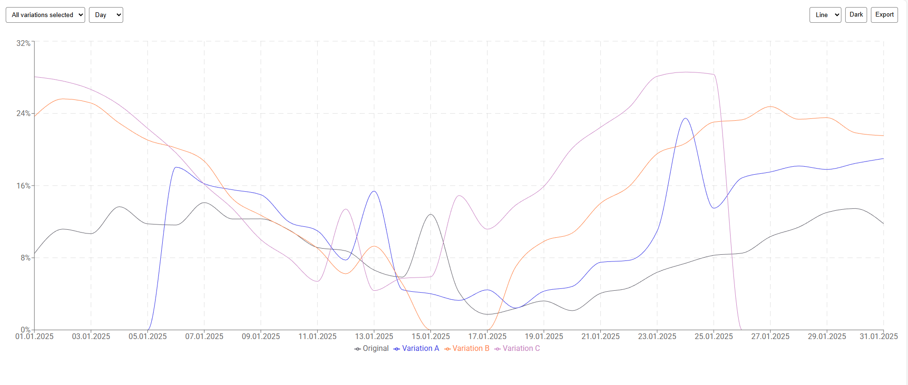
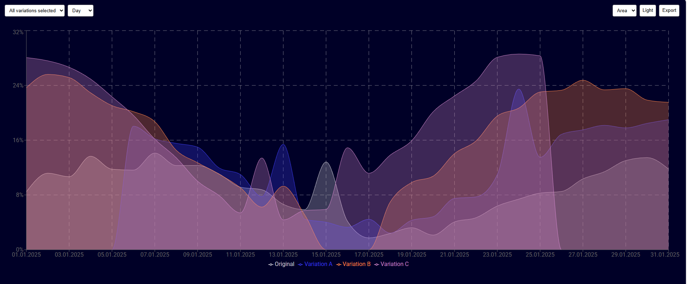
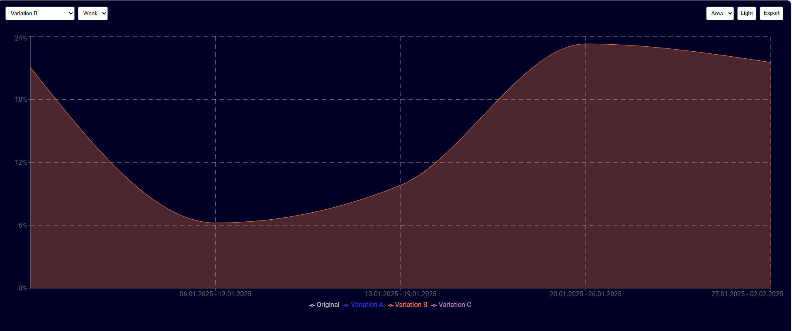

# React + TypeScript + Vite

📈 Interactive Line Chart

This project is an Interactive Line Chart built with React and powered by the Recharts library.
It includes a fully responsive interface, multiple data-viewing modes, theming, exporting, and rich user interaction features.







Core Chart Engine:
Recharts

Export to PNG:
recharts-to-png (NPM package)

Implemented Features:

Required Features:

Variations selector Allows selecting which lines to display (Variation A, B, C, Original, All).
Day / Week selector Switches the chart between daily and weekly aggregated view.
Responsive layout Optimized layout for screens between 671px and 1300px.
Auto-adjusting axes Both X and Y axes adapt dynamically to the visible data range based on selected variations.
Percent formatting All chart values are displayed as percentages.
Hover interactions Shows a vertical guideline and a detailed data tooltip on hover.

Bonus Features:

Chart type selector Choose between Line and Area chart styles.
Light / Dark theme toggle Full theme switch support using CSS variables.
Export to PNG One-click export of the displayed chart using recharts-to-png.

Local Installation:

Clone the repository and install dependencies:

npm install

Start the project:

npm run dev

---

This template provides a minimal setup to get React working in Vite with HMR and some ESLint rules.

Currently, two official plugins are available:

- [@vitejs/plugin-react](https://github.com/vitejs/vite-plugin-react/blob/main/packages/plugin-react) uses [Babel](https://babeljs.io/) (or [oxc](https://oxc.rs) when used in [rolldown-vite](https://vite.dev/guide/rolldown)) for Fast Refresh
- [@vitejs/plugin-react-swc](https://github.com/vitejs/vite-plugin-react/blob/main/packages/plugin-react-swc) uses [SWC](https://swc.rs/) for Fast Refresh

## React Compiler

The React Compiler is not enabled on this template because of its impact on dev & build performances. To add it, see [this documentation](https://react.dev/learn/react-compiler/installation).

## Expanding the ESLint configuration

If you are developing a production application, we recommend updating the configuration to enable type-aware lint rules:

```js
export default defineConfig([
  globalIgnores(["dist"]),
  {
    files: ["**/*.{ts,tsx}"],
    extends: [
      // Other configs...

      // Remove tseslint.configs.recommended and replace with this
      tseslint.configs.recommendedTypeChecked,
      // Alternatively, use this for stricter rules
      tseslint.configs.strictTypeChecked,
      // Optionally, add this for stylistic rules
      tseslint.configs.stylisticTypeChecked,

      // Other configs...
    ],
    languageOptions: {
      parserOptions: {
        project: ["./tsconfig.node.json", "./tsconfig.app.json"],
        tsconfigRootDir: import.meta.dirname,
      },
      // other options...
    },
  },
]);
```

You can also install [eslint-plugin-react-x](https://github.com/Rel1cx/eslint-react/tree/main/packages/plugins/eslint-plugin-react-x) and [eslint-plugin-react-dom](https://github.com/Rel1cx/eslint-react/tree/main/packages/plugins/eslint-plugin-react-dom) for React-specific lint rules:

```js
// eslint.config.js
import reactX from "eslint-plugin-react-x";
import reactDom from "eslint-plugin-react-dom";

export default defineConfig([
  globalIgnores(["dist"]),
  {
    files: ["**/*.{ts,tsx}"],
    extends: [
      // Other configs...
      // Enable lint rules for React
      reactX.configs["recommended-typescript"],
      // Enable lint rules for React DOM
      reactDom.configs.recommended,
    ],
    languageOptions: {
      parserOptions: {
        project: ["./tsconfig.node.json", "./tsconfig.app.json"],
        tsconfigRootDir: import.meta.dirname,
      },
      // other options...
    },
  },
]);
```
